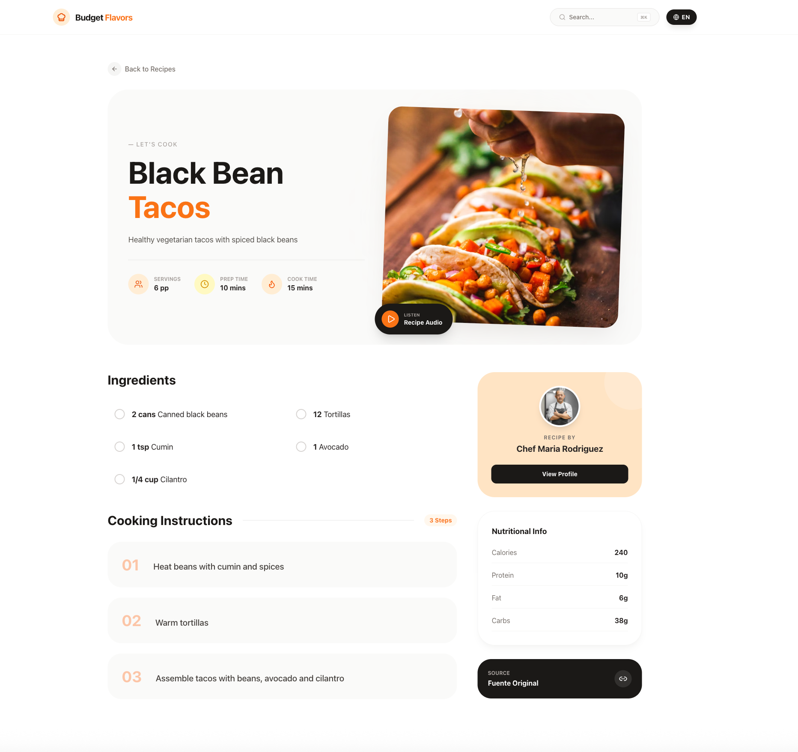

# AI-Powered Recipe Platform | AI 驱动的食谱平台

[**Live Demo / 在线演示**](https://budgetflavors.vercel.app/en)

A modern, localized recipe discovery platform reimagined with AI integration. This project demonstrates a full-stack Next.js application that combines traditional web architecture with advanced AI capabilities to deliver dynamic, multilingual content, along with a serverless backend service built on PostgreSQL.

这是一个结合了 AI 技术的现代本地化食谱发现平台。本项目展示了一个全栈 Next.js 应用，它将传统 Web 架构与先进的 AI 能力相结合，提供动态的多语言内容和建立在PostgreSQL上的无服务器的后端服务应用。




---

## 🇺🇸 English Version

## 🚀 Key Features

### 🤖 AI Integration
- **Intelligent Search & Generation**: Uses Gemini AI to understand natural language queries and generate detailed recipes on the fly.
- **Real-time Translation**: Automatic bidirectional translation (EN/ES) for all recipe content, ensuring a seamless experience across languages.
- **Contextual Understanding**: The AI understands culinary context, capable of adapting recipes based on dietary restrictions or ingredient availability.
- **Text-to-Speech**: Built-in voice synthesis for reading cooking instructions aloud, supporting hands-free cooking.

### 🏗 Architecture & Tech Stack

- **Framework**: [Next.js 15](https://nextjs.org/) (App Router) for server-side rendering and optimized performance.
- **Language**: TypeScript for type-safe, maintainable code.
- **Styling**: Tailwind CSS for a responsive, modern, and clean UI design.
- **Internationalization**: `next-intl` for robust routing and content localization.
- **Database**: Supabase (PostgreSQL) for reliable data persistence and caching of generated recipes.
- **State Management**: React Hooks for local UI state and responsive interactions.

### ⚡ Performance & UX
- **Smart Caching**: Generated recipes are cached in Supabase to reduce API costs and improve latency for subsequent requests.
- **Responsive Design**: Mobile-first approach ensuring a great experience on all devices.
- **Interactive UI**: Features like "Cooking Mode" (step-by-step navigation), ingredient checklists, and dynamic rating systems.

## 🛠 Project Structure

```
src/
├── app/                 # Next.js App Router (Pages & Layouts)
│   ├── [locale]/        # Localized routes (en/es)
│   └── api/             # Backend API routes
├── components/          # Reusable UI components
│   ├── RecipeDetail     # Complex recipe view with interactions
│   ├── SearchModal      # AI-powered search interface
│   └── ...
├── services/            # Business logic & External integrations
│   ├── recipeService    # Supabase & AI orchestration
│   └── geminiService    # AI generation logic
├── lib/                 # Shared utilities (Supabase client, etc.)
└── messages/            # i18n translation files
```

## 💡 What Makes This Special?
Unlike static recipe sites, this platform generates content dynamically. If a user searches for "Spicy Vegan Tacos with Mango," the system doesn't just look for a database match—it **creates** the recipe if it doesn't exist, translates it, saves it for future users, and presents it instantly. This "Generation-First" approach solves the content emptiness problem of new platforms.
(Note: You need to deploy it yourself and add your own OpenAI API Base URL/API Key configuration.)

## 🏃‍♂️ Getting Started

1. **Clone the repo**
   ```bash
   git clone https://github.com/yourusername/budgetbytes-copy.git
   ```

2. **Install dependencies**
   ```bash
   npm install
   # or
   yarn install
   ```

3. **Environment Setup**
   Create a `.env.local` file with your credentials:
   ```env
   NEXT_PUBLIC_SUPABASE_URL=your_supabase_url
   NEXT_PUBLIC_SUPABASE_ANON_KEY=your_supabase_key
   MINIMAX_API_KEY=your_key
   ```

4. **Run Development Server**
   ```bash
   npm run dev
   ```

## 📄 License
MIT

---

## 🇨🇳 中文介绍

## 🚀 核心功能

### 🤖 AI 深度集成
- **智能搜索与生成**：使用 Gemini AI 理解自然语言查询，并即时生成详细的食谱内容。
- **实时翻译**：支持中英/西英双向自动翻译，确保跨语言的无缝体验。
- **上下文理解**：AI 具备烹饪上下文理解能力，可根据饮食限制或现有食材调整食谱建议。
- **语音朗读**：内置语音合成功能，可朗读烹饪步骤，支持免手操作的烹饪体验。

### 🏗 架构与技术栈

- **框架**：[Next.js 15](https://nextjs.org/) (App Router)，提供服务端渲染和卓越的性能优化。
- **语言**：TypeScript，确保代码的类型安全和可维护性。
- **样式**：Tailwind CSS，打造响应式、现代化且整洁的 UI 设计。
- **国际化**：`next-intl`，提供强大的路由和内容本地化支持。
- **数据库**：Supabase (PostgreSQL)，用于可靠的数据持久化和生成食谱的缓存。
- **状态管理**：React Hooks，处理本地 UI 状态和响应式交互。

### ⚡ 性能与用户体验
- **智能缓存**：生成的食谱会自动缓存到 Supabase，降低 API 成本并显著提高后续请求的响应速度。
- **响应式设计**：移动优先的设计理念，确保在所有设备上都能获得极佳的体验。
- **交互式 UI**：包含“烹饪模式”（分步导航）、食材检查清单和动态评分系统等功能。

## 💡 项目亮点
与传统的静态食谱网站不同，本平台的内容是**动态生成**的。如果用户搜索“芒果味塔可”，系统不会仅仅去数据库查找匹配项——如果不存在，它会即时**创造**这份食谱，对其进行翻译，保存以供未来用户使用，并立即展示给当前用户。这种“生成优先”的方法完美解决了新平台内容匮乏的问题。
(备注： 你需要自行部署并且添加适配OpenAI API的Base URL/API Key的配置)

## 🏃‍♂️ 快速开始

1. **克隆仓库**
   ```bash
   git clone https://github.com/yourusername/budgetbytes-copy.git
   ```

2. **安装依赖**
   ```bash
   npm install
   # 或
   yarn install
   ```

3. **环境配置**
   在根目录创建 `.env.local` 文件并填入你的凭据：
   ```env
   NEXT_PUBLIC_SUPABASE_URL=your_supabase_url
   NEXT_PUBLIC_SUPABASE_ANON_KEY=your_supabase_key
   MINIMAX_API_KEY=your_key
   ```

4. **启动开发服务器**
   ```bash
   npm run dev
   ```

## 📄 许可证
MIT
